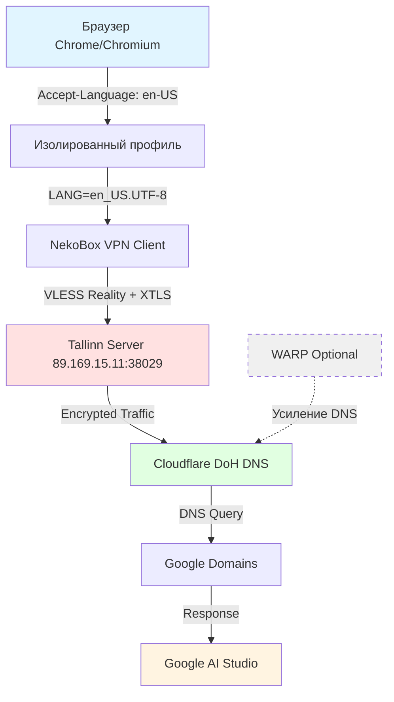

# Архитектура системы обхода блокировок Google Gemini

## Обзор

Проект реализует многоуровневую систему обхода региональных блокировок Google AI Studio (Gemini API) через комбинацию VPN-туннелирования, DNS-маскировки и подмены языковых настроек браузера.

## Схема компонентов

## Уровни защиты

### 1. Сетевой уровень (NekoBox VPN)

**Протокол:** VLESS Reality + XTLS-RPRX-Vision

**Функции:**
- IP маскировка → Estonia (89.169.15.11)
- TLS fingerprint маскировка → yahoo.com
- XTLS туннелирование → обход DPI

### 2. DNS уровень (Cloudflare DoH)

**Критичный параметр:**
\`\`\`json
"use_dns_object": true  // ДОЛЖЕН быть true!
\`\`\`

### 3. Приложенческий уровень (Браузер)

**Критично:**
- chrome://settings/languages → удалить русский ПОЛНОСТЬЮ
- chrome://settings/clearBrowserData → очистить всё (All time)
- Новый Google аккаунт (создан через VPN, Estonia)

## Компоненты проекта

### Скрипты мониторинга

- scripts/monitor-logs.sh - Логи NekoBox в реальном времени
- scripts/vpn-status.sh - Статус VPN (IP, трафик, сервер)
- scripts/quick-check.sh - Быстрая проверка готовности
- scripts/apply-dns-config.sh - Применение DNS конфигурации

### Ключевые метрики

| Параметр | Проверка | Ожидаемое |
|----------|----------|-----------|
| IP адрес | ipleak.net | 89.169.15.11 (Estonia) |
| DNS | dnsleaktest.com | Cloudflare (1.1.1.1) |
| Language | ipleak.net | en-US (без ru!) |
| WebRTC | browserleaks.com/webrtc | No leaks |

